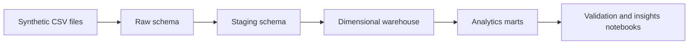
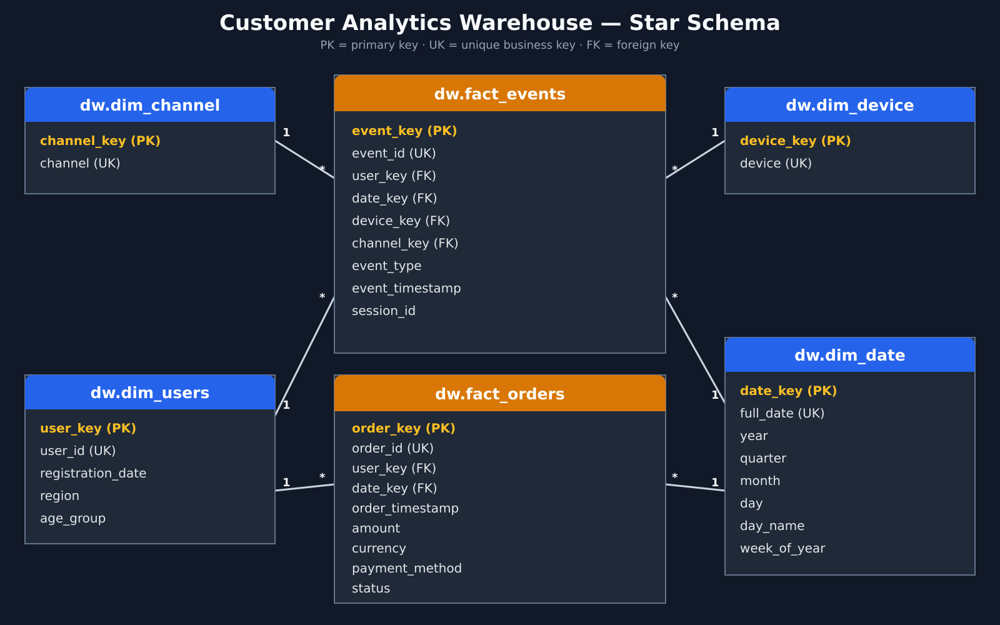

# Customer Funnel and LTV Analytics Data Warehouse

An individual portfolio project that demonstrates how synthetic user, event, and order data can be organised into a layered PostgreSQL analytics warehouse and transformed into reusable funnel and customer-value marts.

> **Portfolio scope:** all data in this repository is simulated. The workflow is a documented local batch pipeline, not a production deployment. Business observations are illustrative and are not claims about a real company.

## Project at a glance

| Item | Description |
| --- | --- |
| Business focus | Customer funnel performance and observed-period revenue per registered user |
| Source data | Synthetic users, daily events, and daily orders |
| Observation period | 1–7 October 2025 |
| Warehouse layers | Raw → staging → dimensional warehouse → analytics marts |
| Core tools | PostgreSQL, SQL, Python, pandas, SQLAlchemy, Jupyter |
| Main outputs | Daily funnel, segment funnel, and LTV-proxy marts |

## What this project demonstrates

- Validation of source schemas, keys, domains, timestamps, and relationships.
- Repeatable loading of daily CSV files into a PostgreSQL raw layer.
- Staging transformations followed by dimension and fact-table construction.
- Surrogate-key mapping and referential integrity in a star schema.
- Reusable SQL marts for daily funnel, segment funnel, and customer-value analysis.
- Clear interpretation of analytical results with explicit data limitations.

## Architecture





Detailed documentation:

- [Pipeline architecture](docs/architecture.md)
- [Data dictionary](docs/data_dictionary.md)
- [Star schema source](docs/star_schema.svg)

## Data snapshot

The included synthetic dataset contains:

- 3,000 users
- 5,181 events across seven daily files
- 283 orders across seven daily files, including 253 paid orders
- Eight Australian regions and six age groups

The data contains no names, email addresses, phone numbers, or other direct personal identifiers.

## Repository structure

```text
customer-funnel-ltv-data-warehouse/
├── data/
│   └── raw/                         # Synthetic source CSV files
├── docs/
│   ├── architecture.md              # Layer-by-layer workflow
│   ├── data_dictionary.md           # Source and warehouse definitions
│   ├── star_schema.svg              # Editable schema diagram
│   └── star_schema.png              # GitHub preview image
├── dw/
│   ├── sql/                         # Raw, staging, dimension, and fact SQL
│   └── marts/                       # Funnel and LTV-proxy mart SQL
├── notebooks/
│   ├── 01_validate_raw_data.ipynb
│   ├── 02_load_raw_data.ipynb
│   ├── 03_analytics_mart_design.ipynb
│   └── 04_analytics_insights.ipynb
├── .env.example                     # Safe database configuration template
├── .gitattributes                   # Consistent repository line endings
├── .gitignore
├── README.md
└── requirements.txt
```

## Local setup

### 1. Prerequisites

- Python 3.11 or later
- PostgreSQL 14 or later
- Git

### 2. Create a local environment

Windows PowerShell:

```powershell
py -m venv .venv
.\.venv\Scripts\Activate.ps1
python -m pip install --upgrade pip
pip install -r requirements.txt
```

macOS or Linux:

```bash
python3 -m venv .venv
source .venv/bin/activate
python -m pip install --upgrade pip
pip install -r requirements.txt
```

The `.venv` directory is intentionally excluded from Git.

### 3. Configure PostgreSQL

Create a local database:

```sql
CREATE DATABASE customer_analytics_dw;
```

Copy `.env.example` to `.env`, then add your local PostgreSQL password:

```dotenv
PGHOST=localhost
PGPORT=5432
PGDATABASE=customer_analytics_dw
PGUSER=postgres
PGPASSWORD=your_local_password
```

The real `.env` file is ignored by Git. Never commit database credentials.

## Run the pipeline

Run the following stages in order. Commands assume that `psql` is available in the terminal; the same SQL files can also be opened in pgAdmin Query Tool.

### Stage 1 — Validate source data

Open and run `notebooks/01_validate_raw_data.ipynb`.

### Stage 2 — Create the raw database layer

```bash
psql -U postgres -d customer_analytics_dw -f dw/sql/00_init_schemas.sql
psql -U postgres -d customer_analytics_dw -f dw/sql/01_raw_tables.sql
```

### Stage 3 — Load raw CSV files

Open and run `notebooks/02_load_raw_data.ipynb`.

The loader uses project-relative paths, reads credentials from `.env`, and truncates each raw target before reloading it.

### Stage 4 — Build staging tables

```bash
psql -U postgres -d customer_analytics_dw -f dw/sql/10_staging_tables.sql
psql -U postgres -d customer_analytics_dw -f dw/sql/11_load_staging_users.sql
psql -U postgres -d customer_analytics_dw -f dw/sql/12_load_staging_events.sql
psql -U postgres -d customer_analytics_dw -f dw/sql/13_load_staging_orders.sql
```

### Stage 5 — Build dimensions and facts

```bash
psql -U postgres -d customer_analytics_dw -f dw/sql/20_dw_dimensions.sql
psql -U postgres -d customer_analytics_dw -f dw/sql/21_load_dim_users.sql
psql -U postgres -d customer_analytics_dw -f dw/sql/22_load_dim_date.sql
psql -U postgres -d customer_analytics_dw -f dw/sql/23_load_dim_device.sql
psql -U postgres -d customer_analytics_dw -f dw/sql/24_load_dim_channel.sql
psql -U postgres -d customer_analytics_dw -f dw/sql/30_dw_facts.sql
psql -U postgres -d customer_analytics_dw -f dw/sql/31_load_fact_events.sql
psql -U postgres -d customer_analytics_dw -f dw/sql/32_load_fact_orders.sql
```

### Stage 6 — Build analytics marts

```bash
psql -U postgres -d customer_analytics_dw -f dw/marts/fact_daily_funnel.sql
psql -U postgres -d customer_analytics_dw -f dw/marts/fact_ltv.sql
psql -U postgres -d customer_analytics_dw -f dw/marts/fact_segment_funnel.sql
```

### Stage 7 — Review design and results

Open `notebooks/03_analytics_mart_design.ipynb` and `notebooks/04_analytics_insights.ipynb`.

## Analytical definitions

- **Daily funnel:** distinct users reaching view, click, and paid-purchase stages on each day.
- **Segment funnel:** distinct users reaching each stage within a region and age-group segment.
- **LTV proxy:** paid revenue observed during the seven-day dataset divided by all registered users in each cohort and segment.

The LTV metric is intentionally described as a proxy: this short simulated observation window is not sufficient to estimate true customer lifetime value.

## Validation and rerun behaviour

- Raw source schemas, keys, domains, timestamps, and user relationships are checked before loading.
- Raw targets are truncated before each notebook load to prevent duplicate ingestion.
- Staging tables are rebuilt from the raw layer.
- Fact business identifiers are unique, and repeated fact loads use `ON CONFLICT DO NOTHING`.
- Mart tables are dropped and rebuilt from the dimensional warehouse.

## Limitations

- The dataset is synthetic and covers only seven days.
- Results describe this generated sample and should not be generalised to a real market.
- Correlation and segment comparisons are descriptive, not causal evidence.
- Small segments can produce unstable rates and revenue-per-user values.
- Production scheduling, cloud deployment, monitoring, and CI/CD are outside the portfolio scope.

## Suggested repository topics

`postgresql` · `data-warehouse` · `sql` · `python` · `jupyter` · `dimensional-modeling` · `analytics-engineering` · `synthetic-data`
