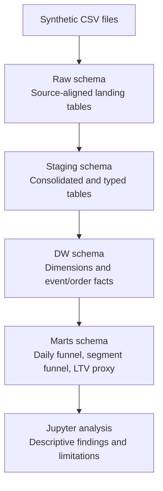

# Pipeline Architecture

This project uses a documented local batch workflow. Each layer has a narrow responsibility so that source loading, data-quality checks, warehouse modelling, and analytical outputs remain easy to inspect.

## Layer responsibilities

### Raw

- Receives the 15 supplied CSV files.
- Preserves the source columns and adds ingestion metadata.
- Uses one event table and one order table per source date.

### Staging

- Consolidates daily source tables.
- Derives `event_date` and `order_date` from timestamps.
- Enforces unique business identifiers within the combined data.

### Dimensional warehouse

- Maps users, dates, devices, and channels into dimensions.
- Maps source business identifiers to warehouse surrogate keys.
- Stores event-level and order-level facts with foreign-key constraints.

### Analytics marts

- `marts.fact_daily_funnel`: one row per observed date.
- `marts.fact_segment_funnel`: one row per region and age-group segment.
- `marts.fact_ltv`: one row per registration month, region, and age group.

## Execution model

The workflow is deliberately run as a transparent sequence of notebooks and SQL scripts. Production scheduling, cloud orchestration, and monitoring are not represented in this portfolio version.
